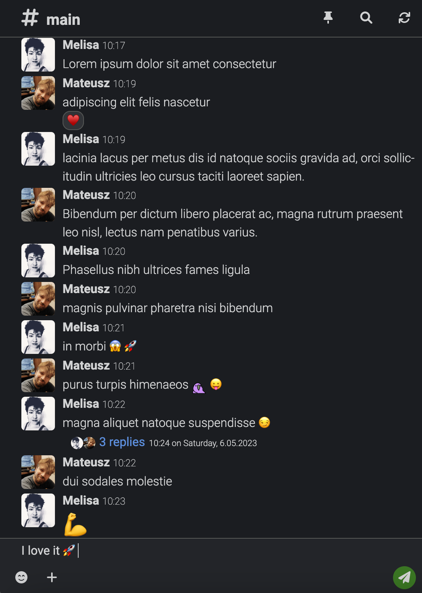

<p align="center">
  
</p>

[](https://github.com/codecat-io/chat/actions/workflows/release.yml)
[](https://shields.io/github/v/release/codecat-io/chat?display_name=tag)
[](code_of_conduct.md)
[](https://opensource.org/licenses/MIT)

Welcome to the Quack - private chatting application.

Quack is a free and open-source chat application designed for private use. 
With its easy-to-use interface and seamless integration with web browsers, Quack is a Progressive Web Application that can be accessed from any platform that has a web browser, such as Chrome.

<p align="center">
  
</p>

Quack is inspired by Slack, but is more affordable for private use. Although it doesn't have any unique features, it combines the best features from other communicators.
Quack prioritizes privacy and security by allowing users to host their own app, ensuring that they have complete control over their data.

## Configuration

To override default settings `chat.config.js` file can be created in root directory of the project.
File should export folowing object:
```javascript
type ChatConfig = {
  port?: number // default `PORT` env otherwise `8080`
  sessionSecret?: string // auto generated on first run to `secrets.json` but can be overwritten here
  vapid?: { // auto generated on first run to `secrets.json` but can be overwritten here
    publicKey: string
    secretKey: string
  },
  databaseUrl?: string // default `DATABASE_URL` env
  cors?: string[] // by default [ 'https?://localhost(:[0-9]{,4})' ],
  fileStorage?: 'memory' | 'gcs' // default `memory`
  gcsBucket?: string // google cloud bucket name
  serverWebUrl?: string // default: 'http://localhost:8080',
  imagesUrl: string // currently it's imgix.com integration but to be removed
};
```

## Environment variables

`GOOGLE_APPLICATION_CREDENTIALS` [string] - (optional) when gcs storage method is used

## Requirements
- MongoDB
- google cloud key for GCS


## Files persistence
Currently supporting GCS. To enable it set `fileStorage` in config file to `gcs` specify `gcsBucket`
and set `GOOGLE_APPLICATION_CREDENTIALS` environment variable.

## Decisions

### Database
We're using a serverless MongoDB instance because of its reliability and cost-effectiveness - we only pay for what we use.
The cheapest option available on Mongo Atlas is sufficient for application, as we don't require any internal pub/sub functionality.


### Server
It would be nice to have a serverless solution, but for now, the cheapest option is using GCE. 
I have no idea how to propagate messages to other serverless instances without a hosted pub/sub service.
MongoDB, Redis, and Postgres need to be hosted to watch for messages.
Perhaps Google Cloud Pub/Sub would be a good option?

## Local development setup

```bash
pnpm i
docker-compose up -d
pnpm run dev
```

## Default credentials

```
admin / 123
member / 123
```
Currently, there is no actual admin with special permissions; all users are equal.
Additionally, there is no way to create users other than modifying database entries.
Managing users is yet to be added.

## License

MIT License

Copyright (c) 2023 CodeCat
